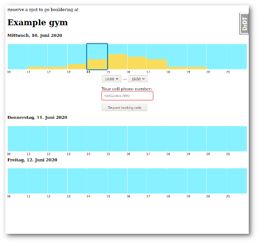
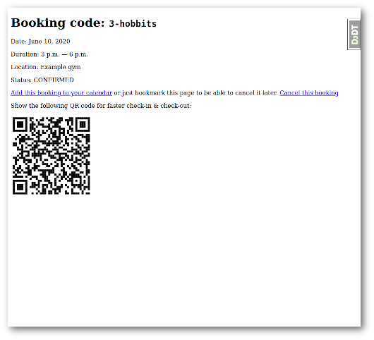
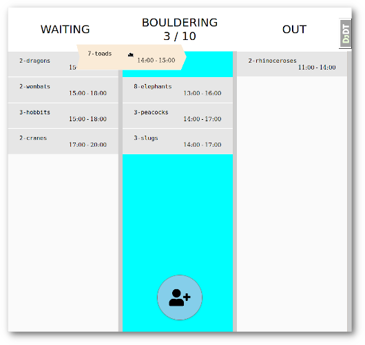

# bouldertime

A booking software primarily aimed to support bouldering gyms during times of COVID19 hygiene regulations.
It uses Django, React and Twilio's SMS service for quick and easy booking and fraud prevention.

## Quicklook

Each gym has an overview page with a customizable number of days to book a slot for.
A bar chart displays the occupancy rate and shows free slots that are still available for booking.
Available slots can be selected from that chart and only require the submission of a valid phone number.

After the booking took place, an SMS containing a verification PIN is sent to the customer's phone number which needs to be entered in a follow up screen to confirm the reservation.
From now on the booking is `confirmed` and can be seen on the gym's dashboard.

The dashboard lists all confirmed bookings of a given day that are either waiting to be checked-in, already checked-in, or left already.
A customer's reservation can be transitioned between the different states via drag'n'drop.

## Getting started

To get your Python environment ready, clone the repository and install the dependencies into a virtualenv:

    git clone https://github.com/jnns/bouldertime.git
    cd bouldertime
    python3 -m venv .venv
    source .venv/bin/activate
    pip install -r requirements.txt
    python manage.py runserver

Docker is recommended for development at least. There's a configuration in place that helps you get going quickly with Docker-Compose. It provides a PostgreSQL server with Adminer web interface:

    cd bouldertime
    docker-compose up -d

ParcelJS will bundle all frontend related assets.
If you're working on the frontend, it is helpful to have the bundler run in watch mode:

    cd bouldertime/frontend
    yarn install
    yarn run watch

To run the tests, invoke pytest from the project root (make sure the virtualenv is active):

    cd bouldertime
    pytest

## Further development

There was a brief period of time during the COVID19 lockdown in which I got this off the ground, but it turns out that existing solutions were already in place for all the gyms I reached out to.
This means that I'm not planning on spending more time on this, for the moment.

I'm open-sourcing it for other people to take this further if they can put it to use.
If you want me to continue to develop this, please just reach out to me. I'd be more than happy to get this into production somewhere.

### Unfinished features

- Add stylesheets and a design.
- A localStorage based overview of a customer's bookings.
- Add options for additional fields on the registration form (your government might require you to collect customer data).
  - Revert the hashing of phone numbers (this was initially thought of as a good privacy measure)
- Use task worker (Celery?) for automatically blocking no-show bookings.
- Add an optional payment system to the booking process.
